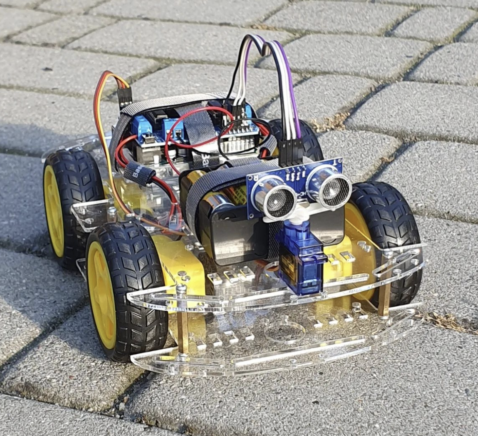

# Obstacle Avoiding Car
Welcome to the Obstacle Avoiding Car Project! This project uses an Arduino Uno R3, L293D motor driver shield, HC-SR04 ultrasonic sensor, and 65 x 26 mm 5V (48:1) motors to create a car that can autonomously avoid obstacles

## Components
- **Arduino Uno R3**: The main microcontroller board that controls the car;
- **L293D Motor Driver Shield**: Controls the motors;
- **HC-SR04 Ultrasonic Sensor**: Detects obstacles by measuring distance;
- **65 x 26 mm 5V Motors (48:1)**: Drives the car's wheels;

## Libraries
This project uses the following Arduino libraries:
- **NewPing**: For controlling the HC-SR04 ultrasonic sensor;
- **AFMotor**: For controlling the motors through the L293D motor driver shield;

## Troubleshooting
- **Car does not move**: Check the connections to the motors and ensure the motor driver shield is properly attached to the Arduino;
- **Sensor not detecting obstacles**: Sensor not detecting obstacles: Verify the connections to the HC-SR04 sensor and ensure it is properly mounted;
- **Inconsistent behavior**: Ensure the power supply is stable and the batteries are charged;
